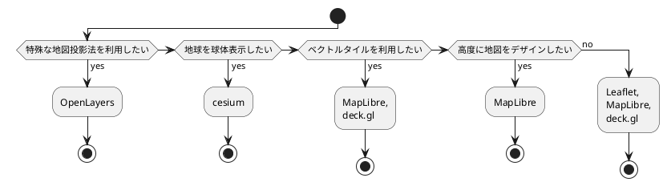

# 第4章 位置情報アプリケーション開発: 入門編

## 4-1. 位置情報ライブラリの紹介
- [leaflet](https://leafletjs.com/)
- [MapLibre GL JS](https://maplibre.org/)
  - `WeBGL`, ベクトルタイルを技術基盤とするOSS
- [Turf.js](https://turfjs.org/)
  - 空間演算を行うためのライブラリ
  - 空間演算
    - 2点間の距離計算、ポリゴンの面積計算、ポリゴン同士が重なっているかの判定など
- [OpenLayers](https://openlayers.org/)
  - 様々な地図投影法に対応している
- [DECK.GL](https://deck.gl/)
  - データビジュアライズに特化
  - 3D表現を含む美麗な地図表現を簡単に実装できる
  - WebGLをベースにしていて、ハイパフォーマンス
- [CesiumJS](https://cesium.com/)
  - 地形や建物などの3D表現に特化したライブラリ
  - WebGLをベースにしている
- [D3.js](https://d3js.org/)
  - 地図ではなくデータビジュアライズに用いられるライブラリ
  - 様々な地図投影法を用いて位置情報を可視化できる

### COLUMN WebGLと地図ライブラリ
- [WebGL](https://www.khronos.org/webgl/)
- `WebGL`
  - ブラウザからGPUを使用することで高パフォーマンスな3D描画を可能とする標準仕様
  - 学習コストが高いので、`Three.js`, `Babylon.js` などのライブラリを通じて利用することが多い
- `deck.gl`
  - カスタムシェーダーでの描画にも対応しているため、最小限の記述でWebGLの世界を覗くことができる

### COLUMN 地図ライブラリの選び方



## 4-2. テーマ別ハンズオン
### 4-2-3. 地図上にピンを立てる
- [平面直角座標系](https://www.gsi.go.jp/LAW/heimencho.html)
  - 全部で19種類ある

### 4-2-4. 地図上に多くのピンを立てる
- [国土数値情報 - 学校データ](https://nlftp.mlit.go.jp/ksj/gml/datalist/KsjTmplt-P29-v2_0.html)
- wsl2にhtmlを置いてchromeで開くとcross originのエラーが出る
  - vscodeの `Live Preview` で開く

### 4-2-5. 地図上にもっと多くのピンを立てる
- 全国のデータは描画までに1分以上待ったし、描画後も触れない

### 4-2-6. 地図上に図形を表示する
- [地理院タイル(空中写真)](https://cyberjapandata.gsi.go.jp/{z}/{x}/{y}.jpg) が404

### COLUMN ポリゴンデータの頂点の保持の仕方
- 例えば三角形を描くとき、3点だけではなく、始点、終点が一致するように4点持たせるのが一般的
- [Simple Feature Access – Part 1: Common Architecture](https://www.ogc.org/standard/sfa/)

### 4-2-7. 地図上に多くの図形を表示する
- 色を塗り分けたポリゴンを重ねた地図を `コロプレス図` と呼ぶ
- Leaflet
  - baseLayersの配列を、L.control.layersに与えるだけで右上のラジオボタンで背景レイヤの切り替えができるようになる
- 万単位の図形を描画しているため、動作が重い
  - 位置情報アプリで気を配るべき3要素「通信料」「データ処理」「描画」のうち、描画が課題
- そこで、Leafletではなく、WebGLを使う
- ここでは、MapLibre GL JS を使用

### 4-2-8 地図上にもっと多くの図形を表示する
- `4-2-7` は多いといってもGeoJSONの合計ファイルサイズは 78MB だった
- **位置情報の世界では数十MBは非常に小さいデータ**
- ここで用いるべきは **ベクトルタイル**
- ベクトルタイル化のコマンド

```bash
# N03-21_210101.geojson をズームレベル0-8 の範囲で、tilesディレクトリにタイル化するコマンド

tippecanoe -e tiles N03-19_190101.geojson -l admin -ab -z8 -pC -P
```

### 4-2-8 地図上にもっと多くの図形を表示する

### 4-2-9 地図上に画像を表示する

### 4-2-10 地図上に大きな画像を表示する

### 4-2-11 地図のスタイリング

#### COLUMN 地図スタイリングの世界
- 地図スタイリングをすべてコード上で行うのは難しいため、GUI上でスタイリングできるアプリも存在する
- [Maputnik](https://maputnik.github.io/)

## 4-3. その他の位置情報技術

### 4-3-1 地図表現

### 4-3-2. ジオコーディング
- ジオコーディング
  - テキストを入力として緯度経度を得る処理
- 逆ジオコーディング
  - 緯軽度から地名を得る処理
- [nominatim (Open-source geocoding with OpenStreetMap data)](https://nominatim.org/)

### 4-3-3. ルーティング
- ルーティング
  - 地点間の最適経路を求める処理
  - 経路計算には道路ネットワークが必要
- [OSRM (open source routing machine)](https://project-osrm.org/)
- [valhalla ()](https://gis-ops.com/routing-and-optimisation/valhalla/)
